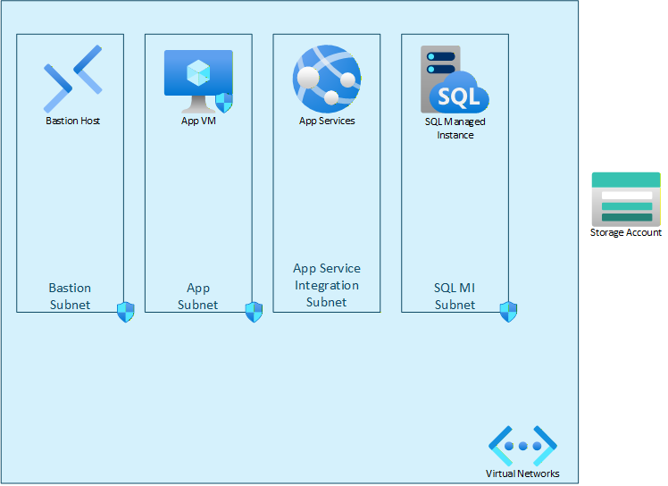
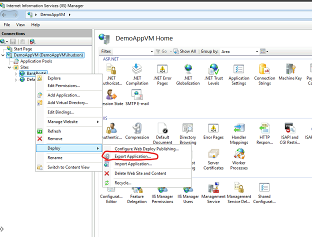
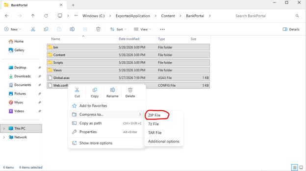
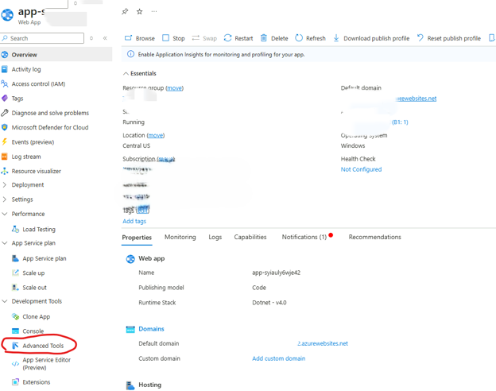
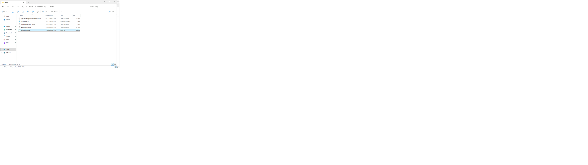
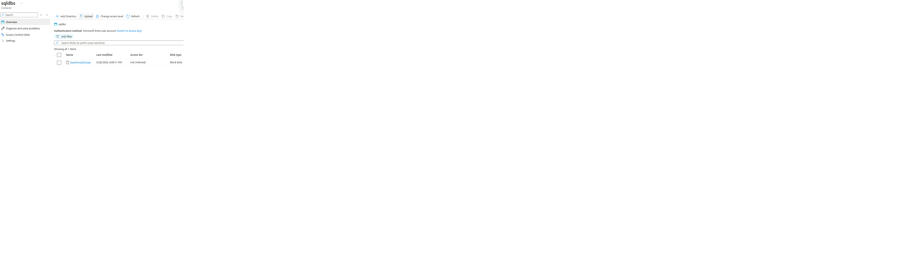
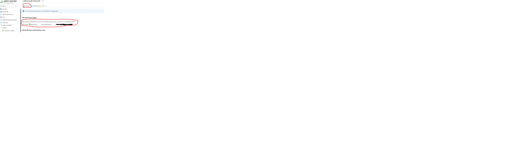
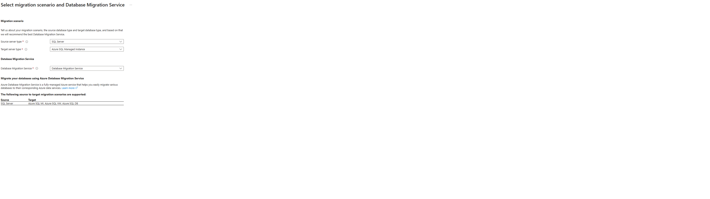
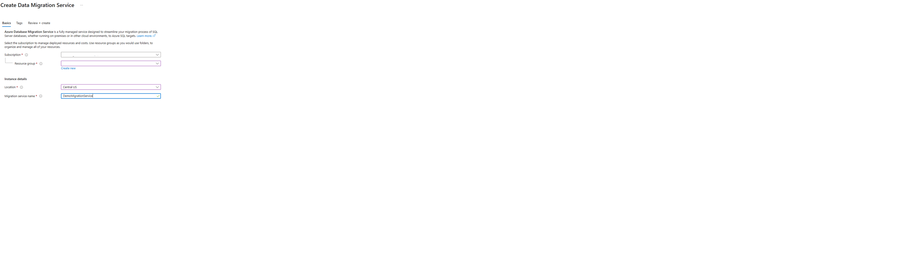
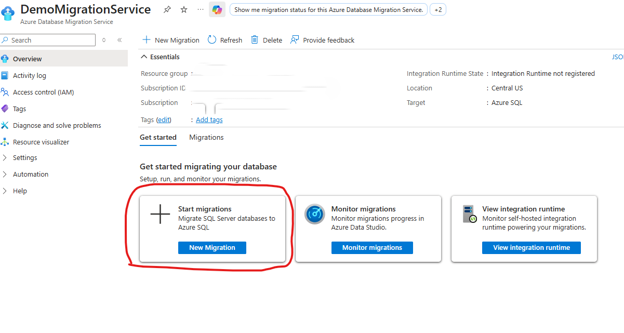

# DotNetMigrationDemo
The purpose of this demo environment is to provide experience with migrating a .Net application from virtual machines to Azure App service and SQL Managed Instance. This is a common migration pattern as moving an application from VM to Azure PaaS allows customers to focus more on their application and not on managing server environments. The image below gives a preview of the Azure resources that are deployed. 

The demo .Net application is installed on the App VM virtual machine. It is a basic banking application that allows money transfers between several bank accounts. The application is deployed to IIS. The application uses SQL as its backend database. SQL server 2022 Developer Edition is installed on the App VM virtual machine. This document will provide guidance on how to migrate the application from IIS to the deployed App Service resource. In addition, the SQL database will be moved to the SQL Managed Instance.

1.	[The link here](https://portal.azure.com/#create/Microsoft.Template/uri/https%3A%2F%2Fraw.githubusercontent.com%2FMr-MSFT%2FDotNetMigrationDemo%2Fmain%2FDemoAppMigrationARM.json) can be used to deploy the ARM template via the Azure portal. The ARM template deploys all the necessary resources   for the demo. The resources can take    up to two hours to deploy.
2.	Log into the App VM via bastion. There will be a link on the desktop named **BankPortal** that launches the demo web application. Take some time to play do some account        transfers and become familiar with the app.
    

# Source  Code Assessment
The first thing you should get acquainted with is running assessments on the source code and IIS deployment. The assessments are important because they highlight if there will need to be code changes or changes to the IIS configuration in order to get the application to work in Azure App service. The [Azure Migrate application and code assessment tool](https://learn.microsoft.com/en-us/azure/migrate/appcat/dotnet?view=migrate#install-the-cli-tool) can be used to perform this assessment. The source code is located at **C:\BankPortal**. Generate and review some assessment reports.

# Migrate Application to Azure App Service
This section provides general guidance on how to export the IIS application and deploy it to the Azure App service instance. The application is purposed built to be able to deploy to Azure App service with no code changes. 
1.	Navigate to the **Server Manager – Tools – Internet Information Services (IIS) Manager**
2.	Navigate to the **BankPortal** site, right-click it and select **Deploy – Export Application**. Complete the Export Application wizard. 
  
3.	Extract the ZIP folder you created in the previous step and created another compressed folder that just contains the contents of the Content\BankPortal sub-directory as shown below. This new ZIP will be deployed to the Azure App service instance.  
4.	Navigate to the App service resource in the Azure portal. Navigate to **Development Tools – Advanced Tools** and select **Go->**. 
5.	In the **Advanced Tools** portal navigate to **Tools – Zip Push Deploy**. Copy the Zip file you created into the window.  
6.	The application is now deployed to the App service resource but will throw errors because it does not have access to its backend SQL database. The next section will give guidance on how to move the SQL database to a SQL Managed Instance that the App Service instance has access to. 

# Migrate SQL DB to SQL Managed Instance
This section will give general guidance on backing up a SQL database and restoring it to the deployed SQL Managed Instance.  You should assign your Azure account the **Storage Blob Data Contributor** role on the Storage Account created in the initial Azure deployment. This will ensure your account has the permissions needed to complete the steps below.
1.	Run the BackUpSQLDB.ps1 Powershell script located in the C:\Temp folder. This script will create a backup of the local SQL database in the C:\Temp folder named BankPortalDB.bak  
2.	Copy the BankPortalDB.bak file to the sqldbs container of the storage account created from the initial deployment. You should assign your Azure account the Storage Blob Data Contributor role to complete this task.   
3.	In the Azure portal navigate to the SQL Managed Instance resource – **Settings – Microsoft Entra ID** and set the Azure App service’s Managed Identity as the admin.    
4.	In the Azure portal create an **Azure Database Migration Service resource**. The configuration for the resources are shown below:      
	 
5.	Navigate to the newly created Azure Database Migration Service resource and start a new migration.   
6.	The migration should be configured as shown detailed below:
a.	**Source server type**: SQL Server
b.	**Target server type**: Azure SQL Managed Instance
c.	**Backup file storage location**: Blob storage
d.	**Migration mode**: Offline
e.	**Is your source SQL Server instance tracked in Azure?** Yes
f.	The **Select Azure resource that tracks the source SQL Server instance** parameters should be the SQL server instance installed on the deployed VM.
g.	The **Select migration target** should be the SQL MI deployed by the earlier ARM template. The **Use Managed Identity** option should be selected.
h.	The **Data source configuration** should be the storage location of the SQL database backup. The Target database name should be **BankPortalDB**
7.	After the database is restored the demo application should work as expected if a user browses to its URL. 

